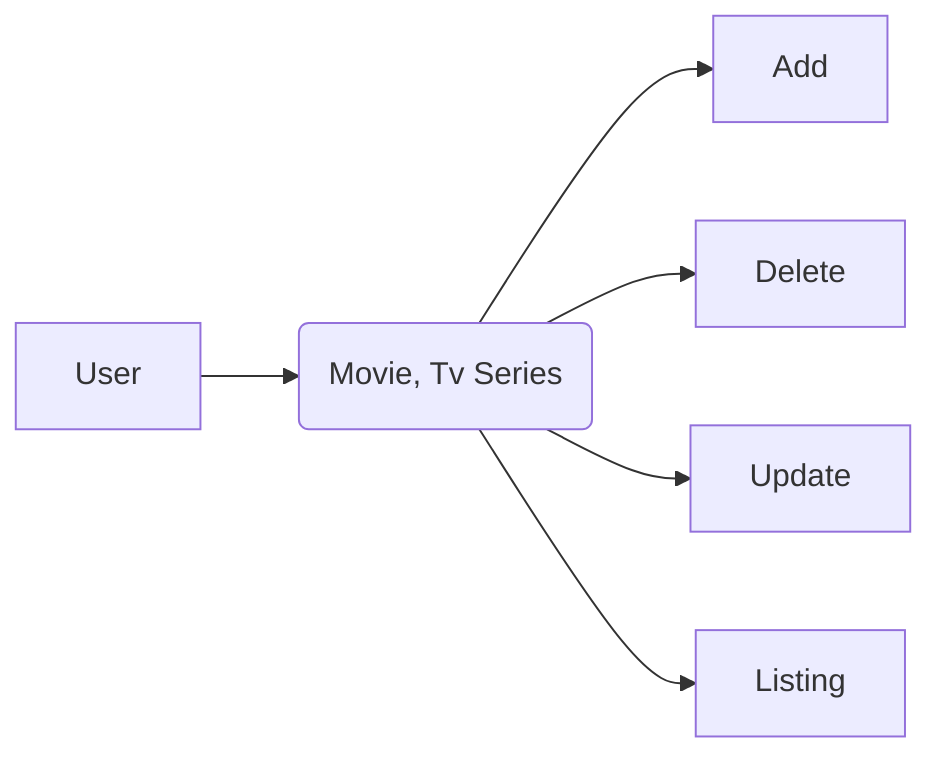

# About The Project

### Index

### Detail

### Admin

## Project Limits
- Add, remove, update and listing functions in the Movies and Categories tables.

## Works
| No  | Work Name | Time |
| ------------- | ------------- | ------------- |
| 1 | Determining the Tools to be Used  | 1 Day  |
| 2 | Interface Design  | 1 Day  |
| 3 | Establishing the database  | 1 Day  |
| 4 | Backend Planning  | 1 Day  |
| 5 | Backend Coding  | 1 Day  |
| 6 | Testing the Project and Fixing Errors  | 2 Day  |

## Potential Risks
| Risk Discription  | Risk Level | Impact On The Project | Solutions |
| ------------- | ------------- | ------------- | ------------- |
| Admin Management | High | Since there is no authentication, anyone can make changes to the data. | Identity.Api should be used  |
| User Interface | Low | Users have much less data | More data should be kept in the Database for users  |

## Technologies and tools to be used
* MSSQL
* Figma
* Bootstrap
* Visual Studio

**TMDB Web App**

## **- First**

Users will be able to view movies and TV series added to the index by the Admin.
With this short-scale project, site administrators will be able to manage their websites with a simple interface. In this way, users will be able to be informed about TV series and movies.

Here is a simple flow chart:

  ## **- Database Schema to Follow**      

